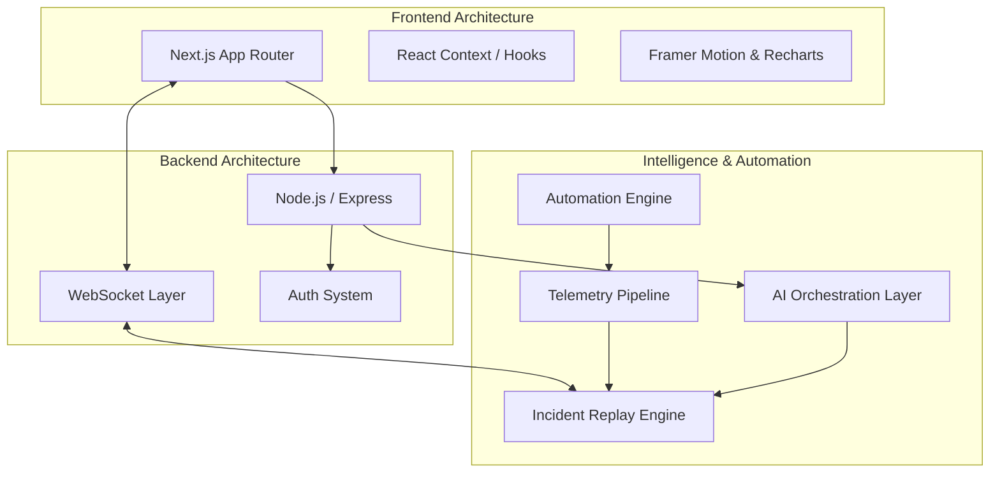

# RootRecall

> Turn operational chaos into structured intelligence.

RootRecall is an AI-native incident intelligence platform built for modern engineering teams to analyze outages, reconstruct failures, automate postmortems, and generate operational insights in realtime. 

Designed with an enterprise-first mindset, RootRecall combines AI-assisted root cause analysis, incident replay, telemetry correlation, and operational memory into a unified, calm experience.


---

## Human Contribution vs AI-Assisted Development

RootRecall was built with a clear distinction between human engineering and AI acceleration. The core product vision, system architecture, and operational logic were entirely human-driven, while AI served as a powerful development accelerant.

**Human Engineered:**
- Product concept and positioning
- System design and architecture direction
- UI/UX ideation and operational workflows
- Incident simulation concepts and flow
- Feature prioritization and selection
- Complex debugging decisions
- Final implementation validation and orchestration

**AI Assisted:**
- Boilerplate code generation and acceleration
- Tactical code suggestions and refactoring
- Documentation formatting and refinement
- Workflow automation scripts
- Rapid UI iteration and component scaffolding

This hybrid approach allowed us to maintain strict architectural control while significantly accelerating execution speed during the development lifecycle.

---

## Development Journey

The engineering journey of RootRecall followed a structured progression from problem identification to deployment:

**Problem** → **Research** → **Architecture** → **Design** → **Backend** → **AI Layer** → **Automation** → **Deployment**

Modern infrastructure generates massive operational noise—logs, metrics, alerts, and deployment events. Existing observability platforms often present this data as fragmented dashboards, requiring engineers to manually correlate events during high-stress outages.

We designed RootRecall differently. We conceptualized an **AI replay engine** that doesn't just show charts, but visually reconstructs the incident timeline. By introducing an **operational memory** system, the platform remembers past failures to provide contextual insights. The simulation engine processes telemetry data to create a believable incident flow, while the UI focuses on calm operational clarity, reducing cognitive load when it matters most.

---

## Real-World Comparison

RootRecall is designed to complement and enhance modern observability stacks by focusing on AI-native intelligence rather than pure metric ingestion.

| Feature | RootRecall | PagerDuty | Datadog | Grafana | Splunk |
| :--- | :--- | :--- | :--- | :--- | :--- |
| **AI-Native Incident Replay** | Yes | No | Limited | No | No |
| **Cinematic Outage Reconstruction** | Yes | No | No | No | No |
| **AI Postmortem Generation** | Yes | Yes (Add-on) | Yes | Limited | Yes |
| **Operational Memory Engine** | Yes | Limited | Limited | No | No |
| **Conversational RCA** | Yes | No | Yes | No | Limited |
| **Deployment Correlation** | Yes | Limited | Yes | Yes | Yes |
| **Incident Similarity Detection** | Yes | Yes | Yes | No | Yes |
| **Human-Readable Incident Narration**| Yes | No | Limited | No | No |
| **Replay-First Debugging** | Yes | No | No | No | No |
| **AI Copilot Workflows** | Yes | Yes | Yes | Limited | Yes |

---

## Architecture

RootRecall employs a modern, decoupled architecture designed for realtime operational intelligence.



- **Frontend:** Next.js application delivering a highly responsive, cinematic UI.
- **Backend:** Node.js/Express handling robust REST APIs and core business logic.
- **WebSocket Layer:** Provides low-latency, bidirectional communication for realtime telemetry and replay streams.
- **AI Orchestration Layer:** Manages interactions with LLMs for root cause analysis and postmortem generation.
- **Incident Replay Engine:** Reconstructs timelines by correlating deployment events and infrastructure health.
- **Telemetry Pipeline:** Ingests and normalizes operational data.
- **Automation Engine:** Drives operational workflows and proactive incident resolution recommendations.

---

## Security

This project was developed with security-first engineering principles despite rapid hackathon timelines.

- **Secure Authentication:** Managed via Google OAuth.
- **Protected Backend Routes:** Strict middleware validation for all sensitive endpoints.
- **Validation Pipelines:** Comprehensive input sanitization to prevent injection attacks.
- **Rate Limiting:** Protection against automated abuse and API exhaustion.
- **Secure Environment Variable Handling:** Isolated configuration management.
- **API Versioning:** Structured endpoint design for future compatibility.

---

## Recommended Demo Flow

To experience the full capabilities of RootRecall, we recommend the following simulation flow:

1. **Healthy Systems:** Observe the realtime operational dashboard in a steady state.
2. **Deployment Event:** Trigger a new deployment to establish a baseline event.
3. **Latency Spike:** Simulate infrastructure degradation following the deployment.
4. **AI Detection:** Watch the platform automatically detect the anomaly and correlate it.
5. **Replay Engine:** Utilize the cinematic replay system to review the exact timeline of failure.
6. **AI Copilot:** Engage the conversational assistant for immediate root cause analysis.
7. **Postmortem Generation:** Automatically draft a comprehensive incident report.
8. **Prevention Recommendations:** Review AI-generated strategies to prevent recurrence.

📺 **[Watch the full product simulation video here](https://drive.google.com/file/d/1lt2wB8-XP_elHoodfndBV5We9yTMzKMk/view?usp=share_link)**

---

## Tech Stack

| Layer | Technologies |
| :--- | :--- |
| **Frontend** | Next.js, TailwindCSS, shadcn/ui, Framer Motion, Recharts |
| **Backend** | Node.js / Express, WebSockets, REST APIs |
| **AI** | Gemini / OpenAI, Incident Analysis Workflows, RCA Generation |
| **Deployment** | Vercel, Railway |
| **Auth** | Google OAuth, JWT / Session Handling |

---

## Local Development

**Frontend Environment:**
```bash
cd frontend
npm install
npm run dev
```

**Backend Environment:**
```bash
cd backend
npm install
npm run dev
```

*(Note: Ensure all environment variables in `.env` are configured prior to starting the development servers. Required services include PostgreSQL, Redis, Google OAuth credentials, and AI API keys.)*

---

RootRecall transforms operational chaos into structured intelligence. 

- **GitHub Repository:** [RootRecall Source Code](https://github.com/org/rootrecall)
- **Live Deployment:** [rootrecall.com](https://rootrecall.com)
- **Demo Video:** [Watch Demo](https://drive.google.com/file/d/1lt2wB8-XP_elHoodfndBV5We9yTMzKMk/view?usp=share_link)
- **Team Credits:** Developed by the RootRecall Engineering Team.
- **License:** MIT License
- **Acknowledgements:** Special thanks to the open-source communities powering our stack.
