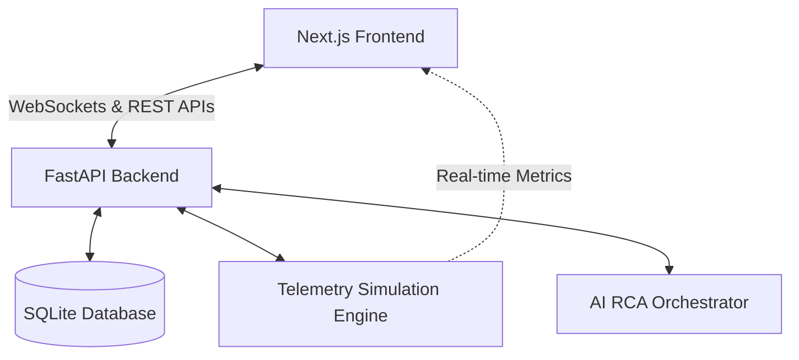

# 🌌 RootRecall

RootRecall is a production-grade, AI-native operational intelligence and automated incident response platform. It acts as an autonomous SRE copilot that monitors microservices, runs real-time telemetry simulations, automatically determines root cause analyses (RCA), and generates interactive system replays and postmortems to prevent future failures.

---

## 🏗️ System Architecture

RootRecall is built with a decoupled modern fullstack architecture:



### 1. Frontend Architecture (Next.js)
* **Framework:** Next.js 15+ (App Router) using TypeScript.
* **Styling:** Tailwind CSS v4 featuring premium dark-mode visuals, smooth micro-interactions, neon accents, and a custom hardware-accelerated ambient video background (`AmbientVideo.tsx`).
* **State Management & Telemetry:** Seamless live updates using WebSockets to render microservice topologies, event stream logs, and live charts.
* **Static Optimization:** Fully dynamic parts (e.g. onboarding parameters and replay queries) use `<Suspense>` boundaries to ensure proper static HTML/JS compiler optimization.

### 2. Backend Architecture (FastAPI & SQLite)
* **Web Framework:** FastAPI (Python) for asynchronous endpoints, live WebSocket server routing, and database integrations.
* **Database & ORM:** SQLite backed by SQLAlchemy, seeding pre-defined incident histories, system logs, and operational memories automatically on startup.
* **Simulation Engine (`simulation_engine.py`):** Runs a background state machine simulating incident life cycles (Healthy ➔ Incident Triggered ➔ Root Cause Found ➔ Remediation Active ➔ Healthy).
* **AI Orchestrator (`ai_orchestrator.py`):** Mocked heuristic engine modeling cognitive reasoning steps to generate highly accurate RCA summaries and remediation playbooks based on historical anomalies.

---

## 🌟 Key Features & Interface Map

### 1. Marketing & Authentication
* **Landing Page:** Interactive service dashboard sneak-peeks, key benefits, and high-performance metrics tables.
* **Pricing Portal:** Visual grid comparing developer, team, and enterprise SRE features.
* **Robust Auth Flows:** Interactive Login and Signup, dynamic company onboarding forms, and a secure password reset system.

### 2. SRE Operations Workspace
* **Main Dashboard:** Live WebSocket-powered telemetry node monitoring, event streams, active incident indicators, and quick actions.
* **Interactive Incident Replay (`/replay`):** SVG-based time-travel visualizer showing active microservice connections, server degradation highlights, event queues, and temporal graph replays.
* **AI Copilot Pane:** Slide-over assistant providing contextual AI chat, diagnostic triggers, and real-time state overrides.
* **Postmortem Database (`/postmortems`):** Fully interactive editor to view auto-generated timeline writeups, analyze preventative actions, and commit updates to the DB.
* **System Settings:** Control panel to customize simulation intervals, toggle auto-remediation behaviors, and edit agent parameters.

---

## 🚀 Quickstart Guide (Local Development)

### 1. Prerequisites
* **Python** 3.8+
* **Node.js** 18+
* **npm**, **yarn**, or **pnpm**

---

### 2. Running the Backend (FastAPI)

1. Navigate to the backend directory:
   ```bash
   cd backend
   ```
2. Create and activate a virtual environment:
   ```bash
   python -m venv venv
   source venv/bin/activate  # On Windows: venv\Scripts\activate
   ```
3. Install dependencies:
   ```bash
   pip install -r requirements.txt
   ```
4. Run the FastAPI development server:
   ```bash
   uvicorn main:app --reload --port 8000
   ```
   * *The server will start at `http://127.0.0.1:8000`*
   * *Auto-docs are available at `http://127.0.0.1:8000/docs`*

---

### 3. Running the Frontend (Next.js)

1. Navigate to the frontend directory:
   ```bash
   cd frontend
   ```
2. Install npm packages:
   ```bash
   npm install
   ```
3. Run the development server:
   ```bash
   npm run dev
   ```
   * *The app runs at `http://localhost:3000`*

---

## 🧪 Simulation Mechanics

The `SimulationEngine` runs continuously in the background on the FastAPI server to demonstrate RootRecall's operational flow:
1. **Healthy State:** System operates normally. Graph shows green nodes (`gateway`, `auth-service`, `payment-api`, `database`).
2. **Anomaly Trigger:** A database lock or third-party payment timeout is introduced.
3. **RCA Generation:** RootRecall AI detects the anomaly, analyzes historical memories, determines root cause, and generates remediation playbooks.
4. **Remediation:** If **Auto-Remediate** is toggled **ON** in Settings, the system heals itself automatically after a short analysis delay. If **OFF**, it pauses until a user clicks "Apply Remediation" in the Dashboard or Copilot panel.
5. **Self-Healed / Healthy:** System returns to normal state, generating an entry in the Postmortem database.

---

## 📦 Deployment Guide

RootRecall is a fullstack monorepo. The **frontend** deploys to Vercel and the **backend** deploys to Railway (or Render/Fly.io).

---

### 🔷 Frontend — Vercel

#### Step 1 — Import the repo

1. Go to [vercel.com/new](https://vercel.com/new)
2. Click **"Add New Project"** → Import `karanscosmo/rootrecall` from GitHub
3. On the configuration screen:

| Setting | Value |
|---|---|
| **Framework Preset** | `Next.js` |
| **Root Directory** | `frontend` |
| **Build Command** | *(leave blank — auto-detected)* |
| **Output Directory** | *(leave blank — auto-detected)* |
| **Install Command** | *(leave blank — auto-detected)* |

> ⚠️ Make sure **"Include files outside the root directory in the Build Step"** is **Enabled**.

#### Step 2 — Add Environment Variables

In Vercel → **Settings → Environment Variables**, add:

| Key | Value | Required |
|---|---|---|
| `NEXT_PUBLIC_API_URL` | `https://your-backend.up.railway.app` | Required for API calls |
| `NEXT_PUBLIC_WS_URL` | `wss://your-backend.up.railway.app/ws/telemetry` | Required for live telemetry |
| `GOOGLE_CLIENT_ID` | *(your Google OAuth client ID)* | Optional — enables real Google login |
| `GOOGLE_CLIENT_SECRET` | *(your Google OAuth secret)* | Optional |
| `GOOGLE_REDIRECT_URI` | `https://your-vercel-domain.vercel.app/api/auth/callback` | Optional |

> 💡 You can deploy without the backend env vars first. The app will fully load with seeded demo data. Add the backend URL after deploying Railway.

#### Step 3 — Deploy

Click **Deploy**. The frontend will be live in ~60 seconds at `https://rootrecall.vercel.app`.

---

### 🟣 Backend — Railway

The FastAPI backend requires a persistent process (background simulation engine + WebSocket server), so it must be deployed on a platform that supports long-running servers.

#### Option A — Railway (Recommended, free tier available)

1. Go to [railway.app](https://railway.app) → **New Project** → **Deploy from GitHub Repo**
2. Select `karanscosmo/rootrecall`
3. Set **Root Directory** to `backend`
4. Railway auto-detects Python → click **Deploy**
5. After deploy: go to **Settings → Networking → Generate Domain**
6. Copy the generated URL (e.g. `https://rootrecall-production.up.railway.app`)
7. Paste it into Vercel as `NEXT_PUBLIC_API_URL` and `NEXT_PUBLIC_WS_URL` (with `wss://` prefix)

#### Option B — Render

1. Go to [render.com](https://render.com) → **New Web Service**
2. Connect `karanscosmo/rootrecall` → set Root Directory to `backend`
3. Set **Start Command** to:
   ```bash
   uvicorn main:app --host 0.0.0.0 --port 8000
   ```
4. Deploy → copy your Render URL

#### Option C — Fly.io

```bash
cd backend
fly launch
fly deploy
```

---

### 🔁 After Both Are Deployed

1. Copy your Railway/Render backend URL
2. Go to **Vercel → Settings → Environment Variables**
3. Update:
   - `NEXT_PUBLIC_API_URL` → `https://your-backend-url`
   - `NEXT_PUBLIC_WS_URL` → `wss://your-backend-url/ws/telemetry`
4. Go to **Vercel → Deployments** → **Redeploy** to pick up the new env vars

The live dashboard will now show real-time telemetry, WebSocket-powered incident streams, and the full simulation engine loop. ✅

---

### ⚠️ What Works on Vercel vs. Full Backend

| Feature | Vercel (frontend only) | + Railway Backend |
|---|---|---|
| Landing page, pricing, docs | ✅ | ✅ |
| Auth (mock Google login) | ✅ | ✅ |
| Dashboard UI (seeded data) | ✅ | ✅ |
| Live WebSocket telemetry | ❌ | ✅ |
| Simulation engine (auto-incidents) | ❌ | ✅ |
| REST API (incidents, postmortems) | ❌ | ✅ |

---

Detailed infra notes available in [docs/deployment.md](docs/deployment.md).
