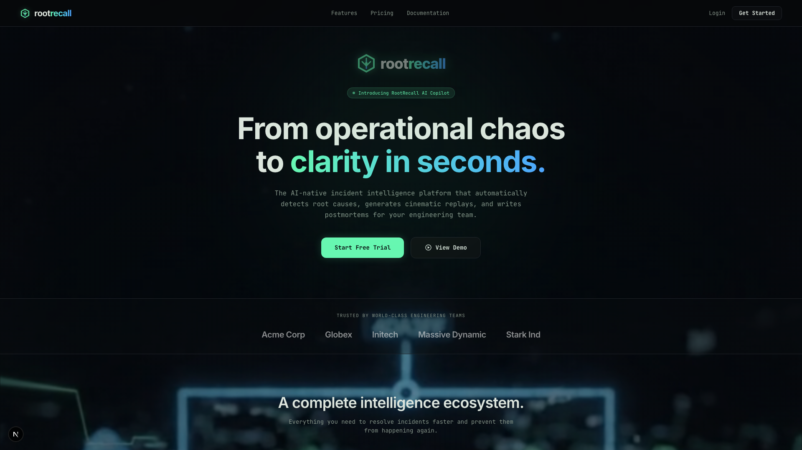
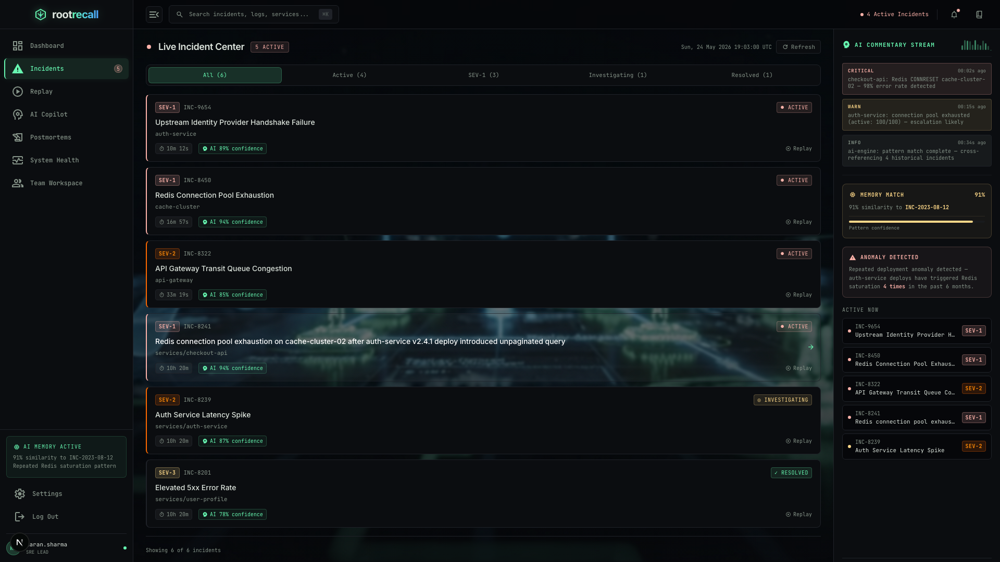
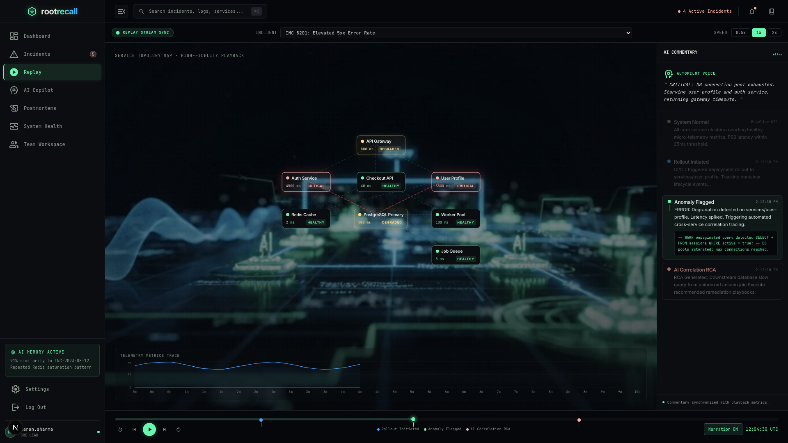

# RootRecall

> Turn incidents into intelligence.

RootRecall is an AI-native incident intelligence platform built for modern engineering teams to analyze outages, reconstruct failures, automate postmortems, and generate operational insights in realtime.

Designed with an enterprise-first mindset, RootRecall combines AI-assisted root cause analysis, incident replay, telemetry correlation, and operational memory into a unified experience.





---

# Overview

Modern infrastructure generates massive operational noise:
- logs
- metrics
- alerts
- deployment events
- traces
- failures

RootRecall transforms this fragmented operational data into structured incident intelligence.

Instead of manually debugging outages across multiple dashboards, engineering teams can:
- replay incidents visually
- analyze root causes using AI
- generate postmortems automatically
- correlate deployments with failures
- identify recurring operational patterns
- improve incident response speed

---

# Core Features

## AI Incident Copilot
Conversational AI assistant for:
- root cause analysis
- infrastructure explanations
- outage summaries
- rollback guidance
- recurrence prediction
- remediation recommendations

---

## Incident Replay Engine
Cinematic operational replay system that reconstructs:
- deployment timelines
- infrastructure failures
- cascading outages
- latency spikes
- service degradation



---

## AI Postmortem Generator
Automatically generates:
- incident summaries
- RCA reports
- impact analysis
- lessons learned
- prevention recommendations
- operational timelines

---

## Realtime Operational Dashboard
Unified command center with:
- live telemetry
- incident streams
- deployment tracking
- service health
- AI insights
- anomaly detection

---

## Operational Memory System
RootRecall stores historical operational context to:
- compare incidents
- detect recurring failures
- identify deployment patterns
- improve engineering response quality

---

# Tech Stack

## Frontend
- Next.js
- TypeScript
- TailwindCSS
- shadcn/ui
- Framer Motion
- Recharts

## Backend
- FastAPI
- PostgreSQL
- WebSockets
- Redis
- SQLAlchemy

## AI
- OpenAI API / Gemini API
- AI orchestration layer
- contextual incident reasoning

## Deployment
- Vercel (Frontend)
- Railway / Render (Backend + PostgreSQL)

---

# Product Experience

RootRecall is designed to feel:
- cinematic
- operational
- enterprise-grade
- AI-native
- realtime
- calm under pressure

Inspired by:
- Linear
- Vercel
- modern observability platforms
- AI infrastructure tooling

---

# Architecture

```bash
rootrecall/
├── frontend/
├── backend/
├── shared/
├── docs/
```

---

# Realtime Intelligence Engine

RootRecall uses a centralized operational orchestration layer to correlate:
- deployments
- telemetry
- infrastructure health
- incidents
- AI reasoning
- replay systems

This creates a believable realtime operational environment instead of isolated static dashboards.

---

# Security

RootRecall includes:
- secure authentication
- Google OAuth
- protected API routes
- rate limiting
- CSP headers
- websocket validation
- XSS sanitization
- secure environment isolation

---

# Local Development

## Frontend

```bash
cd frontend
npm install
npm run dev
```

## Backend

```bash
cd backend
pip install -r requirements.txt
uvicorn app.main:app --reload
```

---

# Environment Variables

Create `.env` files using `.env.example`.

Required services:
- PostgreSQL
- OpenAI/Gemini API
- Google OAuth
- Redis

---

# Deployment

## Frontend
Deploy on:
- Vercel

## Backend
Deploy on:
- Railway
OR
- Render

---

# Demo Flow

1. Trigger deployment
2. Simulate outage
3. Detect anomaly
4. AI reconstructs incident
5. Generate postmortem
6. Replay outage timeline
7. Recommend remediation

---

# Vision

RootRecall aims to become an AI-powered operational intelligence system for modern engineering organizations.

The platform is built around one core belief:

> Operational failures should become organizational intelligence.

---

# License

MIT License
