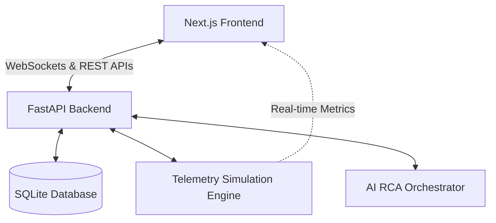

# 🌌 RootRecall

RootRecall is a production-grade, AI-native operational intelligence and automated incident response platform. It acts as an autonomous SRE copilot that monitors microservices, runs real-time telemetry simulations, automatically determines root cause analyses (RCA), and generates interactive system replays and postmortems to prevent future failures.

---

## 🏗️ System Architecture

RootRecall is built with a decoupled modern fullstack architecture:



### 1. Frontend Architecture (Next.js)
* **Framework:** Next.js 15+ (App Router) using TypeScript.
* **Styling:** Tailwind CSS v4 featuring premium dark-mode visuals, smooth micro-interactions, neon accents, and a custom hardware-accelerated ambient video background (`AmbientVideo.tsx`).
* **State Management & Telemetry:** Seamless live updates using WebSockets to render microservice topologies, event stream logs, and live charts.
* **Static Optimization:** Fully dynamic parts (e.g. onboarding parameters and replay queries) use `<Suspense>` boundaries to ensure proper static HTML/JS compiler optimization.

### 2. Backend Architecture (FastAPI & SQLite)
* **Web Framework:** FastAPI (Python) for asynchronous endpoints, live WebSocket server routing, and database integrations.
* **Database & ORM:** SQLite backed by SQLAlchemy, seeding pre-defined incident histories, system logs, and operational memories automatically on startup.
* **Simulation Engine (`simulation_engine.py`):** Runs a background state machine simulating incident life cycles (Healthy ➔ Incident Triggered ➔ Root Cause Found ➔ Remediation Active ➔ Healthy).
* **AI Orchestrator (`ai_orchestrator.py`):** Mocked heuristic engine modeling cognitive reasoning steps to generate highly accurate RCA summaries and remediation playbooks based on historical anomalies.

---

## 🌟 Key Features & Interface Map

### 1. Marketing & Authentication
* **Landing Page:** Interactive service dashboard sneak-peeks, key benefits, and high-performance metrics tables.
* **Pricing Portal:** Visual grid comparing developer, team, and enterprise SRE features.
* **Robust Auth Flows:** Interactive Login and Signup, dynamic company onboarding forms, and a secure password reset system.

### 2. SRE Operations Workspace
* **Main Dashboard:** Live WebSocket-powered telemetry node monitoring, event streams, active incident indicators, and quick actions.
* **Interactive Incident Replay (`/replay`):** SVG-based time-travel visualizer showing active microservice connections, server degradation highlights, event queues, and temporal graph replays.
* **AI Copilot Pane:** Slide-over assistant providing contextual AI chat, diagnostic triggers, and real-time state overrides.
* **Postmortem Database (`/postmortems`):** Fully interactive editor to view auto-generated timeline writeups, analyze preventative actions, and commit updates to the DB.
* **System Settings:** Control panel to customize simulation intervals, toggle auto-remediation behaviors, and edit agent parameters.

---

## 🚀 Quickstart Guide (Local Development)

### 1. Prerequisites
* **Python** 3.8+
* **Node.js** 18+
* **npm**, **yarn**, or **pnpm**

---

### 2. Running the Backend (FastAPI)

1. Navigate to the backend directory:
   ```bash
   cd backend
   ```
2. Create and activate a virtual environment:
   ```bash
   python -m venv venv
   source venv/bin/activate  # On Windows: venv\Scripts\activate
   ```
3. Install dependencies:
   ```bash
   pip install -r requirements.txt
   ```
4. Run the FastAPI development server:
   ```bash
   uvicorn main:app --reload --port 8000
   ```
   * *The server will start at `http://127.0.0.1:8000`*
   * *Auto-docs are available at `http://127.0.0.1:8000/docs`*

---

### 3. Running the Frontend (Next.js)

1. Navigate to the frontend directory:
   ```bash
   cd frontend
   ```
2. Install npm packages:
   ```bash
   npm install
   ```
3. Run the development server:
   ```bash
   npm run dev
   ```
   * *The app runs at `http://localhost:3000`*

---

## 🧪 Simulation Mechanics

The `SimulationEngine` runs continuously in the background on the FastAPI server to demonstrate RootRecall's operational flow:
1. **Healthy State:** System operates normally. Graph shows green nodes (`gateway`, `auth-service`, `payment-api`, `database`).
2. **Anomaly Trigger:** A database lock or third-party payment timeout is introduced.
3. **RCA Generation:** RootRecall AI detects the anomaly, analyzes historical memories, determines root cause, and generates remediation playbooks.
4. **Remediation:** If **Auto-Remediate** is toggled **ON** in Settings, the system heals itself automatically after a short analysis delay. If **OFF**, it pauses until a user clicks "Apply Remediation" in the Dashboard or Copilot panel.
5. **Self-Healed / Healthy:** System returns to normal state, generating an entry in the Postmortem database.

---

## 📦 Deployment Guide

Detailed guidelines for production deployment can be found in [docs/deployment.md](file:///Users/karansharma/Desktop/RootRecall/docs/deployment.md).

### Quick Overview:
* **Backend:** Deploy on **Railway** or **Render** via the included `Procfile`.
* **Frontend:** Deploy on **Vercel** pointing to the repository's `/frontend` directory. Add `NEXT_PUBLIC_API_URL` and `NEXT_PUBLIC_WS_URL` env vars pointing to your deployed backend.
